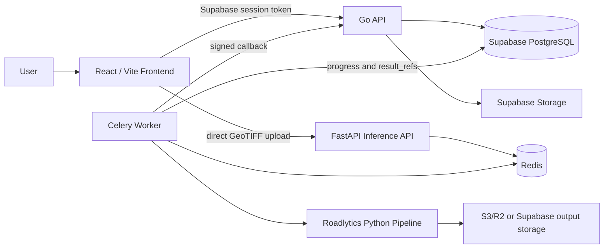

# Roadlytics

Roadlytics is a road quality assessment platform for GeoTIFF-based satellite imagery. Users create projects, upload imagery, run a road assessment pipeline, track progress, inspect outputs, and generate reports.

The current system is split into:

- `frontend/` - React 18, Vite, TypeScript, Supabase Auth, React Router, Leaflet.
- `backend/` - Go API using `chi`, `pgx`, Supabase/PostgreSQL, Supabase Storage, and JWT auth middleware.
- `inference_server_project/` - FastAPI, Celery, Redis, and the Python raster inference pipeline.
- `road_pipeline/` - reusable preprocessing, segmentation, classification, and post-processing code.
- `database/schemas/` - Supabase/PostgreSQL schema and migration files.

## Architecture



The Go API creates projects, regions, and jobs. For large imagery, the frontend uploads directly to the FastAPI inference endpoint returned by the backend, avoiding serverless upload limits. The inference worker updates job status and stores output references in `jobs.result_refs`.

## Pipeline

The inference stack runs:

1. GeoTIFF preprocessing and validation.
2. Road segmentation with DeepLabV3+ or OSM rasterization.
3. Road condition classification with EfficientNet or K-Means.
4. Network/connectivity analysis.
5. Report generation with PDF, CSV, ZIP, and raster outputs.

Expected model weight paths:

```text
weights/
  road segmentation.pth
  road_condition_model.pth
```

The OSM and K-Means paths can be used as lighter alternatives where model weights or GPU access are unavailable.

## Prerequisites

- Node.js 20+
- Go 1.25+
- Python 3.11+
- Docker and Docker Compose v2
- Supabase project
- Redis for local inference/Celery runs
- GPU-capable host recommended for DeepLabV3+/EfficientNet inference

## Environment

Copy the root environment template:

```bash
cp .env.example .env
```

Key root variables:

```text
DATABASE_URL=
SUPABASE_URL=
SUPABASE_ANON_KEY=
SUPABASE_SERVICE_ROLE_KEY=
SUPABASE_JWT_SECRET=
INTERNAL_SECRET=
FRONTEND_URL=http://localhost:5173
VITE_SUPABASE_URL=
VITE_SUPABASE_ANON_KEY=
VITE_API_URL=http://localhost:8080/api/v1
INFERENCE_SERVER_URL=http://localhost:8000
```

For the inference service:

```bash
cp inference_server_project/.env.example inference_server_project/.env
```

Set `SUPABASE_URL`, `SUPABASE_SERVICE_ROLE_KEY`, `BACKEND_CALLBACK_URL`, `INTERNAL_SECRET`, `REDIS_URL`, `DEVICE`, and output storage variables.

Generate `INTERNAL_SECRET` with:

```bash
python -c "import secrets; print(secrets.token_hex(32))"
```

## Database Setup

Run the SQL migrations in Supabase in order:

```text
database/schemas/001_initial_schema.sql
database/schemas/002_supabase_setup.sql
database/schemas/003_rls_policies.sql
database/schemas/004_storage_policies.sql
database/schemas/005_auth_triggers.sql
database/schemas/006_realtime.sql
database/schemas/007_admin_settings.sql
database/schemas/008_raster_migration.sql
database/schemas/009_security_and_consistency.sql
```

Create the required private storage buckets in Supabase:

```text
reports
inference-outputs
```

If using S3/R2 for larger inference artifacts, configure the `S3_*` variables in the inference server environment.

## Local Development

Install and run the frontend:

```bash
cd frontend
npm install
npm run dev
```

Run the backend:

```bash
cd backend
go mod download
go run ./cmd/server
```

Run the inference stack with Docker from the repository root:

```bash
docker compose up redis inference inference-worker
```

The default local URLs are:

```text
Frontend:  http://localhost:5173
Backend:   http://localhost:8080/api/v1
Inference: http://localhost:8000/api/health
```

## VPS Inference Deployment

The inference server is designed for a persistent host with access to model weights and optional GPU acceleration.

```bash
cd inference_server_project
cp .env.example .env
docker compose -f docker-compose.vps.yml up --build -d
```

The VPS compose file starts:

- `inference` - FastAPI control plane.
- `inference-worker` - Celery worker running the raster pipeline.
- `redis` - Celery broker/result backend.
- `nginx` - reverse proxy for the inference API.

Health check:

```bash
curl http://localhost:8000/api/health
```

## API Surface

The backend exposes routes both at the root and under `/api/v1`.

Core routes:

```text
GET  /health
POST /auth/register
GET  /auth/profile
POST /projects
GET  /projects
POST /projects/{id}/regions
POST /jobs
GET  /jobs/{id}
GET  /jobs/{id}/progress
GET  /regions/{id}/jobs
GET  /jobs/{id}/results
POST /jobs/{id}/reports
GET  /reports
GET  /reports/{id}/download
POST /internal/jobs/{id}/progress
```

Admin routes are available under `/admin/*` for approved admin users.

## Tests

Frontend:

```bash
cd frontend
npm test
```

Backend:

```bash
cd backend
go test ./...
```

Integration test assets and scripts live in `testing/` and `frontend-tests/`.

## Migration Direction

The next architecture consolidates the platform into a Next.js + FastAPI deployment:

- Next.js App Router for the frontend and core API.
- Auth.js for application auth.
- Prisma with containerized PostgreSQL.
- FastAPI + Celery + Redis for inference.
- Azure Blob Storage for uploads and outputs.
- Docker Compose on an Azure GPU VM for a simpler operational model.

The existing React, Go, and FastAPI code remains useful reference material for business logic, UI behavior, pipeline orchestration, and data contracts during the migration.
